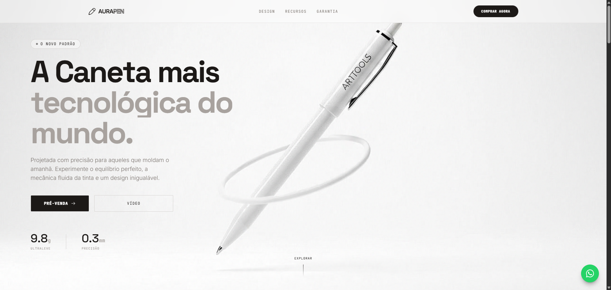

<div align="center">

# 🖋️ Aura Pen — Landing Page de Conversão

**Landing page premium para lançamento de produto, com scroll cinematográfico, SEO técnico completo e conversão real via WhatsApp.**


[🔗 Ver Demo](https://mhsilvadev.github.io/aurapen) · [📋 Funcionalidades](#-funcionalidades) · [🚀 Como usar](#-como-usar)

<br>



</div>

---

## 📖 Sobre o Projeto

Landing page desenvolvida para uma **marca fictícia de canetas premium (Aura Pen)**, unindo dois objetivos: servir como peça de conversão comercial completa (com SEO técnico, CTAs funcionais e captação via WhatsApp) e demonstrar técnica avançada de front-end — o destaque é uma **sequência de 192 imagens renderizada em `<canvas>`**, sincronizada quadro a quadro com o scroll do usuário, a mesma técnica usada em sites de produto de grandes marcas para criar efeito de "vídeo controlado pelo scroll".

> 🧑‍💻 **HTML, CSS e JavaScript no controle total** — Tailwind CSS para utilitários (build local compilado), GSAP para o motor de animação, Lenis para smooth scroll. Sem frameworks de componente (React/Vue).

---

## ✨ Funcionalidades

| Funcionalidade | Descrição |
|:---|:---|
| 🎬 **Canvas Image Sequence Scrubbing** | 192 quadros renderizados em `<canvas>`, sincronizados com o scroll via GSAP ScrollTrigger — cria o efeito de "vídeo" controlado pela rolagem |
| 🔦 **Flashlight Effect** | Rastreamento do cursor (`clientX`/`clientY`) atualizando variáveis CSS nativas na GPU, criando luz radial dinâmica sobre os cards |
| ⏳ **Preloader customizado** | Segura a exibição da página até todos os frames pesados estarem cacheados no navegador, evitando saltos visuais |
| 🎭 **Scroll Reveal & Text Split** | Textos fragmentados letra a letra (SplitType) que revelam conforme o scroll, combinados com fades e translados em eixo Y |
| 🌊 **Smooth Scroll matemático** | Rolagem suave via Lenis — inclusive nos links do menu e footer, que rolam até a seção correta em vez de saltar |
| 💬 **CTAs funcionais via WhatsApp** | Os 3 botões de call-to-action (nav, hero e seção final) e o botão flutuante abrem WhatsApp com mensagem pré-formatada de reserva |
| 🦶 **Footer completo** | Navegação, contato e redes sociais, seguindo a estética dark/minimalista do restante do site |
| 🔍 **SEO técnico completo** | Meta tags, Open Graph, Twitter Card, Schema.org (`Product`), sitemap.xml, robots.txt e favicon |
| ♿ **Acessibilidade** | Heading hierarchy corrigida (h1 único no hero), `alt` descritivo e `aria-label` no canvas |
| ⚡ **Build local do Tailwind** | CSS compilado e minificado via Tailwind CLI — sem dependência de CDN em produção |

---

## 🛠️ Tecnologias

<table>
  <tr>
    <td align="center" width="120">
      
      <br><strong>HTML5</strong>
      <br><sub>Semântico</sub>
    </td>
    <td align="center" width="120">
      
      <br><strong>CSS3</strong>
      <br><sub>Custom Properties</sub>
    </td>
    <td align="center" width="120">
      
      <br><strong>JavaScript</strong>
      <br><sub>ES6+ vanilla</sub>
    </td>
    <td align="center" width="120">
      
      <br><strong>Tailwind CSS</strong>
      <br><sub>Build local (CLI)</sub>
    </td>
  </tr>
</table>

### Destaques técnicos

- **GSAP + ScrollTrigger** — motor principal das animações on-scroll, timelines e sincronização do canvas
- **Canvas API** — sequência de 192 imagens desenhada quadro a quadro conforme o progresso do scroll
- **Lenis** — smooth scroll matemático, incluindo navegação por âncora (menu e footer)
- **SplitType** — fragmentação de texto em letras/palavras para efeitos de revelação tipográfica
- **Tailwind CLI** — build local compilado e minificado (16 KB), migrado do CDN para eliminar overhead de produção
- **Schema.org JSON-LD** — dados estruturados tipo `Product` para SEO

---

## 📁 Estrutura do Projeto

```
aurapen/
├── assets/
│   ├── images/
│   │   ├── aura_pen_fountain_macro_1775595086266.png
│   │   └── favicon.svg
│   ├── video/
│   │   └── video2.mp4
│   └── video_frames/          # 192 frames usados no Canvas Image Sequence
├── css/
│   ├── style.css
│   └── tailwind-built.css      # CSS do Tailwind compilado (gerado, não editar direto)
├── js/
│   └── script.js
├── src/
│   └── tailwind-input.css      # Ponto de entrada do build do Tailwind
├── index.html
├── tailwind.config.js
├── package.json
├── robots.txt
├── sitemap.xml
├── print_site_aurapen.png      # Imagem de preview usada neste README
└── README.md
```

---

## 🚀 Como Usar

### Pré-requisitos

[Node.js](https://nodejs.org/) instalado (necessário para compilar o Tailwind CSS).

### Rodando localmente

Devido ao uso da API do Canvas para carregar imagens locais, rodar este projeto apenas abrindo o `index.html` diretamente no navegador (`file://`) causa erros de **CORS** — é necessário um servidor local.

```bash
# Clone o repositório
git clone https://github.com/MHSilvaDev/aurapen.git
cd aurapen

# Instale as dependências
npm install

# Gere o CSS do Tailwind
npm run build:css

# Sirva o projeto por um servidor local
npx serve .
```

Ou, no VS Code, instale a extensão **Live Server** e clique em "Go Live" com o `index.html` aberto.

> 💡 Durante o desenvolvimento, use `npm run watch:css` para recompilar o Tailwind automaticamente a cada nova classe adicionada.

### Deploy

O projeto está pronto para deploy em qualquer plataforma de hospedagem estática — lembrando de rodar `npm run build:css` **antes** do deploy, já que o `tailwind-built.css` precisa estar atualizado e commitado:

| Plataforma | Comando / Ação |
|:---|:---|
| **GitHub Pages** | Ative nas Settings → Pages → Branch: main |
| **Netlify** | Drag & drop da pasta no dashboard |
| **Vercel** | `vercel --prod` |

---

## ⚠️ Aviso

Este é um **projeto de demonstração/portfólio**, com dados fictícios. Antes de publicar para um cliente real, substitua:

- Telefone e e-mail de contato no footer e nos links de WhatsApp (nav, hero, CTA e botão flutuante)
- Links de Instagram e Facebook no footer (atualmente `href="#"`)
- Domínio placeholder (`aurapen.com.br`) usado no canonical, Open Graph e Schema.org
- Campos de preço/avaliações no Schema.org, caso sejam adicionados — nunca publicar `aggregateRating` fictício, viola as diretrizes do Google

---

## 📄 Licença

Este projeto está sob a licença **MIT**. Veja o arquivo [LICENSE](LICENSE) para mais detalhes.

---

## 👤 Autor

<div align="center">

**Márcio Henrique Silva**

Desenvolvedor Front-End

[](https://github.com/MHSilvaDev)
[](https://www.linkedin.com/in/mhsilvadev/)
[](https://wa.me/5534999147815)
[](mailto:marciohenriquesilva@gmail.com)

</div>

---

<div align="center">

Feito com ☕ e 🖋️ por [MHSilvaDev](https://github.com/MHSilvaDev)

</div>
